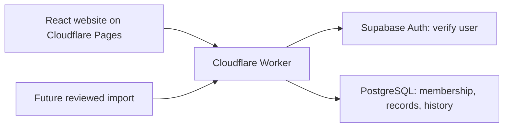

# MLBB Pilot Push architecture plan

Status: checkpoints A–E deployed, 15 September 2026; optional checkpoint F deferred.
Scope: one shared MLBB account, Gaurav and Rupesh, manual Ranked tracking first.
Keep the working site available and deliver one small checkpoint per `continue`.

## 1. Keep the existing application structure

- `apps/web`: forms, navigation and presentation. Split the large `App.tsx` into
  page components when touching those pages; avoid a separate rewrite.
- `packages/tracker`: shared validation, rank rules, season transitions and
  statistics. All screens derive results from the same functions.
- `apps/api`: verify the signed-in user and fixed-account membership on every
  request. Keep privileged credentials in the Worker.
- PostgreSQL: authoritative shared data, transactional saves and revision checks.
  Browser storage remains a recovery/development facility.

## 2. Data model and transition

Today, `tracker_workspaces.state` contains a complete JSON snapshot. Old seasons
are embedded in `audit.before.seasonArchive`; server snapshots also remain in
`tracker_history`. This is the supported launch format. Preserve it until the
replacement is verified, and avoid accumulating new features inside audit data.

The next persistent model introduces explicit records:

| Record          | Essential fields and rules                                                                                                                                                                         |
| --------------- | -------------------------------------------------------------------------------------------------------------------------------------------------------------------------------------------------- |
| Season          | Stable ID, account ID, label, timezone, status, confirmed starting rank, rules version, rank-aware target; at most one active season per account.                                                  |
| Match           | Existing ID retained, season ID, player ID, played-at instant, result, nullable hero and played position, K/D/A, duration, actual star delta, observations, source, timestamps and record version. |
| Hero            | Stable internal ID, optional verified game ID, name and aliases; preserve the original observed name/ID. Unknown heroes remain valid.                                                              |
| Rank checkpoint | Season and match boundary, observed rank/division/stars or placement state, confirmation time and reason.                                                                                          |
| Correction      | Actor, time, reason, affected record and original values; retain deletions as recoverable records.                                                                                                 |

Keep authentication membership separate from the player who played a match.
Positions describe that match's actual role; never infer lane from a hero's class.
Unknown values stay null rather than becoming zero or a guessed result.

## 3. Identity, rank and automation rules

- Keep Battle ID as optional text to preserve long IDs and leading zeros. Enforce
  uniqueness for non-null IDs within the shared account in PostgreSQL. Without
  one, flag likely duplicates for review; timestamps alone are not an identity.
- Use actual star changes, including bonuses and zero for protection. Derive rank
  in chronological order with versioned rules. Missing changes or placement
  uncertainty must visibly interrupt the estimate until a confirmed checkpoint.
- Store targets as rank/division/stars. Convert the current numeric target only
  when its meaning is unambiguous; otherwise request confirmation.
- Season rollover archives the current season and creates the new baseline in
  one transaction. Starting rank corrections require a reason on the server as
  well as in the UI. Never calculate a season reset from an unverified mapping.
- Manual entry and future imports use the same validation and save path. Imports
  first produce reviewable candidates with provenance and an idempotency key;
  retries must not create duplicates or overwrite manual corrections.

## 4. Safe migration and rollback

1. Export and verify the current state, membership and server history. Rehearse a
   restore locally. A Git commit or inspecting live rows is not a data backup.
   Checkpoint A now establishes a verified revision-8 application backup; see
   [backup and rehearsal evidence](backup-rehearsal.md). Refresh it before cutover.
2. Add the new tables and migration tooling without changing the live read path.
   Backfill active matches and season archives with repeatable mappings. Preserve
   IDs, raw legacy snapshots and ambiguous history instead of guessing links.
3. Compare record counts, every match field, attribution, rank and statistics.
   Test concurrent saves, duplicate imports, rollover and denied access.
4. Use a brief write pause for the final migration and comparison. Switch the
   versioned API and UI together; reject old-client writes with a reload message.
   There must be only one writable source of truth.
5. Keep legacy tables for recovery. Before new writes, switching back is possible;
   after new writes, rollback requires a verified reverse export or a forward fix.
   Never restore an old snapshot over newer matches.

## 5. Small delivery checkpoints

| Order | Deliverable                                  | Done when                                                           |
| ----- | -------------------------------------------- | ------------------------------------------------------------------- |
| A     | Verified backup and migration rehearsal      | Restore succeeds; active and archived records compare exactly.      |
| B     | Explicit seasons/matches and versioned API   | Safe cutover, old-client rejection and atomic rollover pass.        |
| C     | Battle ID, hero identity and played position | Duplicate prevention works; unknown observations survive edits.     |
| D     | Rank checkpoints, placement and targets      | Uncertainty is explicit; corrections recalculate consistently.      |
| E     | Focused UI and performance improvements      | Mobile entry, history, player/hero/lane views use shared selectors. |
| F     | Reviewed importer                            | Verified source data exists; retries and manual overrides are safe. |

Each checkpoint includes its relevant tests, diff review, Git checkpoint and
release notes. Checkpoints C–E were deployed together after the final rehearsal
and production backup verification. Stop before optional checkpoint F.
Checkpoint A is complete; see [its results and limitations](backup-rehearsal.md).
Checkpoint B is complete: [B1](checkpoint-b1.md) introduced and rehearsed the
additive read model, and [B2](checkpoint-b2.md) completed the transactional save
path and production cutover. Checkpoints [C](checkpoint-c.md),
[D](checkpoint-d.md) and [E](checkpoint-e.md) are complete and deployed. See
[the final release record](2026-09-15-release.md). The next planned checkpoint
is F: the reviewed importer. It is optional for the manual season-launch release.
Official portraits and extra analytics are optional polish; do not
spend the remaining usage on speculative importer work or a full redesign.
